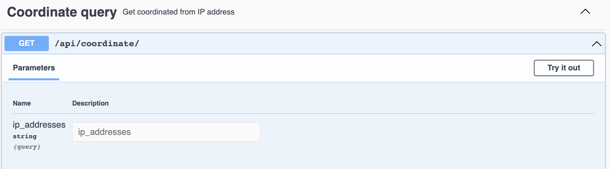

## Ip to Geo 

Conversion of IP addresses to Geographical coordinates using Geolite

## Build & Run

### Docker
Build
```
docker build -t geolite .
```
Run
```
docker run -p 10007:10007 -it geolite 
```

### Python

Install dependencies
```
pip3 install -r requirements.txt
```

Run
```
flask run
```

## Usage Example 

Request to convert the ip addresses 112.210.108.0 and 188.96.91.1 to longitude and latitude
```
GET http://localhost:10007/api/coordinate/?ip_addresses=112.210.108.0,188.96.91.1
```
Response body
```
{
  "locations": {
    "112.210.108.0": {
      "lat": "14.6104",
      "long": "121.0999"
    },
    "188.96.91.1": {
      "lat": "48.8859",
      "long": "12.5724"
    }
  }
}
```

## Swagger UI

swagger UI available at `http://localhost:10007/api/docs`



## Open api specs

```
{
  "host": "oakestra.io",
  "x-internal-id": "1",
  "paths": {
    "/api/coordinate/": {
      "get": {
        "parameters": [
          {
            "in": "query",
            "name": "ip_addresses",
            "schema": {
              "type": "string"
            },
            "required": false
          }
        ],
        "responses": {
          "422": {
            "$ref": "#/components/responses/UNPROCESSABLE_ENTITY"
          },
          "200": {
            "description": "OK",
            "content": {
              "application/json": {
                "schema": {
                  "$ref": "#/components/schemas/QueryResponse"
                }
              }
            }
          },
          "default": {
            "$ref": "#/components/responses/DEFAULT_ERROR"
          }
        },
        "tags": [
          "Coordinate query"
        ]
      }
    }
  },
  "info": {
    "title": "coordinate system",
    "version": "v1"
  },
  "tags": [
    {
      "name": "Coordinate query",
      "description": "Get coordinated from IP address"
    }
  ],
  "openapi": "3.0.2",
  "components": {
    "schemas": {
      "Error": {
        "type": "object",
        "properties": {
          "errors": {
            "type": "object",
            "description": "Errors"
          },
          "code": {
            "type": "integer",
            "description": "Error code"
          },
          "message": {
            "type": "string",
            "description": "Error message"
          },
          "status": {
            "type": "string",
            "description": "Error name"
          }
        }
      },
      "PaginationMetadata": {
        "type": "object",
        "properties": {
          "total": {
            "type": "integer"
          },
          "total_pages": {
            "type": "integer"
          },
          "first_page": {
            "type": "integer"
          },
          "last_page": {
            "type": "integer"
          },
          "page": {
            "type": "integer"
          },
          "previous_page": {
            "type": "integer"
          },
          "next_page": {
            "type": "integer"
          }
        }
      },
      "QueryResponse": {
        "type": "object",
        "properties": {
          "locations": {
            "type": "object"
          }
        }
      }
    },
    "responses": {
      "UNPROCESSABLE_ENTITY": {
        "description": "Unprocessable Entity",
        "content": {
          "application/json": {
            "schema": {
              "$ref": "#/components/schemas/Error"
            }
          }
        }
      },
      "DEFAULT_ERROR": {
        "description": "Default error response",
        "content": {
          "application/json": {
            "schema": {
              "$ref": "#/components/schemas/Error"
            }
          }
        }
      }
    }
  }
}
```
## Default IP DP 

The dafult IP to coordinates database is  <a href="https://db-ip.com/db/lite.php"> </a>
